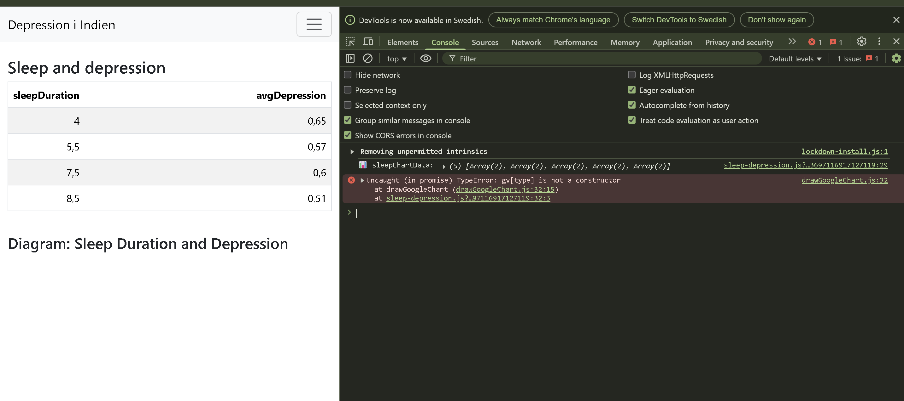

## SQLite - Datatransformering och korrigering

När jag importerade data insåg jag snabbt att vissa kolumner behövde anpassas för att underlätta statistisk analys. Justeringar gjordes

Nedan följer de korrigeringar som jag genomfört.


---

### Sleep Duration
För att kunna analysera sömnens påverkan på depression behövde jag numeriska värden. Eftersom de ursprungliga svaren angav intervaller (t.ex. "7-8 hours") valde jag att approximera medelvärdet av varje intervall: (Rätt eller fel, who knows) Detta är också något som jag får tänka på framöver---> att jag kan justera värdet och göra det möjligt att räkna på det genom att casta om värden 

```sql
UPDATE result SET sleepDuration =
CASE
    WHEN sleepDuration = 'Less than 5 hours' THEN 4
    WHEN sleepDuration = '5-6 hours' THEN 5.5
    WHEN sleepDuration = '6-7 hours' THEN 6.5
    WHEN sleepDuration = '7-8 hours' THEN 7.5
    WHEN sleepDuration = 'More than 8 hours' THEN 8.5
    ELSE NULL
END;
```

### Dietary Habits
Eftersom det är svårt att utföra statistik på textbaserad data konverterade jag dietaryHabits till numeriska värden för enklare analys:

```sql
UPDATE result SET dietaryHabits =
CASE
    WHEN dietaryHabits = 'Unhealthy' THEN 1
    WHEN dietaryHabits = 'Moderate' THEN 2
    WHEN dietaryHabits = 'Healthy' THEN 3
    ELSE NULL
END;
```

### Suicidal Thoughts
För att möjliggöra statistisk bearbetning gjorde jag en binär transformation av svaren:

```sql
UPDATE result SET sucidalThoughts =
CASE
    WHEN sucidalThoughts = 'Yes' THEN 1
    WHEN sucidalThoughts = 'No' THEN 0
    ELSE NULL
END;
```

### History of Mental Illness
Även här behövdes en binär representation:

```sql
UPDATE result SET historyMentalIllness =
CASE
    WHEN historyMentalIllness = 'Yes' THEN 1
    WHEN historyMentalIllness = 'No' THEN 0
    ELSE NULL
END;
```

---

### Speciell korrigering av `sleepDuration`
Transformeringen av `sleepDuration` fungerade initialt inte korrekt och krävde därför korrigering enl nedan:

- Skapade en temporär tabell (`tempSleep`) med endast kolumnerna `id` och `sleepDuration`.
- Jag redigerade ursprungliga CSV-filen för att endast inkludera dessa två kolumner.
- Importerade denna nya CSV-fil till tabellen `tempSleep`.
- Körde följande SQL-query för att uppdatera den slutgiltiga tabellen:

```sql
UPDATE result_new
SET sleepDuration = (
    SELECT CASE
        WHEN sleepDuration = '''Less than 5 hours''' THEN 4
        WHEN sleepDuration = '''5-6 hours''' THEN 5.5
        WHEN sleepDuration = '''6-7 hours''' THEN 6.5
        WHEN sleepDuration = '''7-8 hours''' THEN 7.5
        WHEN sleepDuration = '''More than 8 hours''' THEN 8.5
        ELSE NULL
    END
    FROM tempSleep
    WHERE tempSleep.id = result_new.id
);
```

Efter att jag gjort ovanstående så började jag ställa SELECT queries i VS för att sedan visualisera det med hjälp av (`npm start`)


## Nu jobbar jag med version 5 av mallen

Något som jag inte får att fungera är att googlechart inte visas på localhostsidan. 
I konsolen står det: 

Det är samma kod som jag använde i version 3 av mallen, vilket fungerade väldigt bra. 

Jag har hittat en lösning men då måste jag in och ändra på strukturen hos drawGoogleChart.js i libs.
Tror inte det är rätt väg att gå